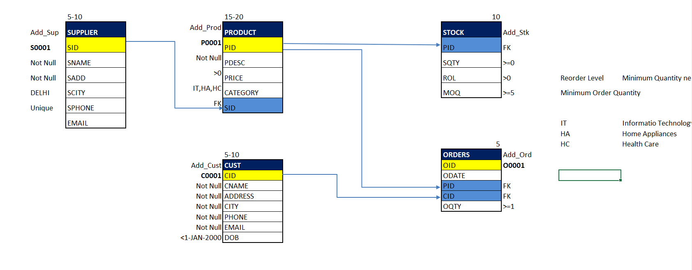

# 📦 SQL Inventory Management System

## 📝 Overview
This project is a fully functional, normalized relational database designed for an Inventory Management System. Built using SQL Server, it demonstrates advanced backend database logic, including automated real-time stock synchronization, data validation, and automated ID generation.

## ⚙️ Key Features
* **Relational Database Design:** Engineered 5 normalized tables (`Supplier`, `Product`, `Stock`, `Customer`, `Orders`) to eliminate data redundancy.
* **Data Integrity:** Enforced strict data governance using Primary/Foreign Key constraints, `CHECK`, `UNIQUE`, and `NOT NULL` constraints.
* **Workflow Automation:** 
  * Custom SQL Functions (`ID_Generator`) for dynamic, alphanumeric ID creation.
  * Modular Stored Procedures for streamlined and secure data entry across all entities.
* **Real-Time Synchronization (Triggers):** 
  * `AFTER INSERT`, `AFTER UPDATE`, and `INSTEAD OF DELETE` triggers engineered to automatically calculate and synchronize stock quantities the moment orders are placed or modified.

## 🛠️ Technology Stack
* **Language:** SQL
* **RDBMS:** Microsoft SQL Server (T-SQL)
* **Core Concepts:** DDL, DML, Functions, Stored Procedures, Triggers, Sequences, Constraints.

## 🗄️ Database Architecture
*(Below is the schema and workflow mapping for the database)*

 
*(Note: To make this image show up, upload your infographic to the 'assets' folder, click on the image in GitHub, copy its URL, and paste it inside the parentheses above).*

## 🚀 How to Run the Project
1. Download the `inventory_database_build.sql` file from the `sql_scripts` folder.
2. Open Microsoft SQL Server Management Studio (SSMS) or your preferred SQL IDE.
3. Run the script in its entirety. It will automatically:
   * Create the `LB_Practise` database.
   * Generate all tables and relationships.
   * Insert sample mock data.
   * Create all Functions, Sequences, Procedures, and Triggers.
4. Test the automation by executing the Order Insertion stored procedure and checking the Stock table!

## 📬 Contact
Created by **Abhijeet Pandey** 
* 💼 LinkedIn: [[Link to your LinkedIn Profile]](https://www.linkedin.com/in/abhijeet-pandey-aa9088187/)
* 📧 Email: abhijeetce0003@gmail.com
